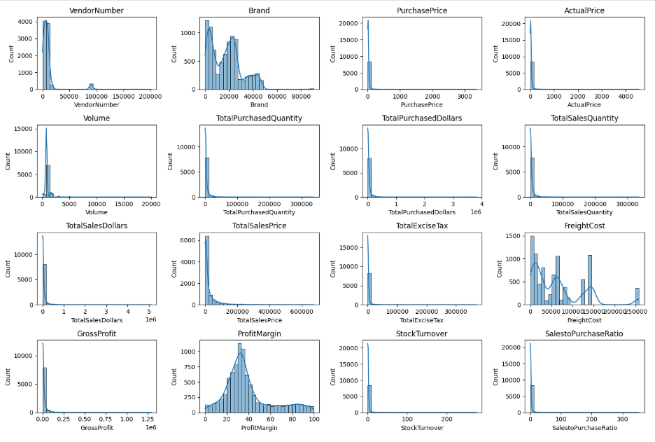
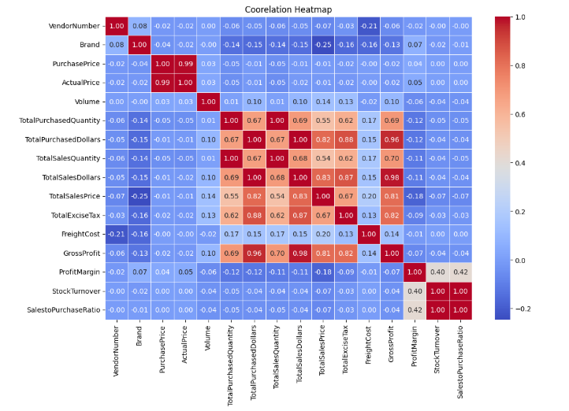
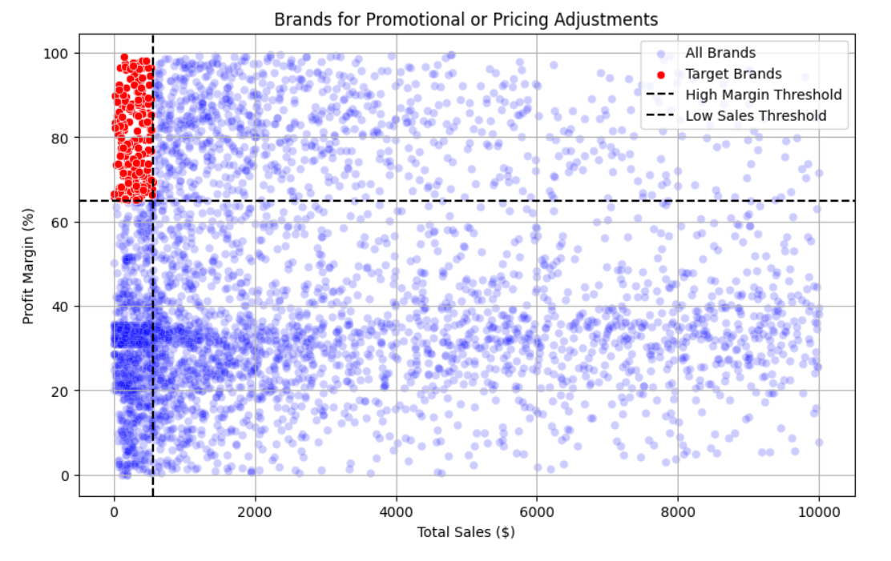
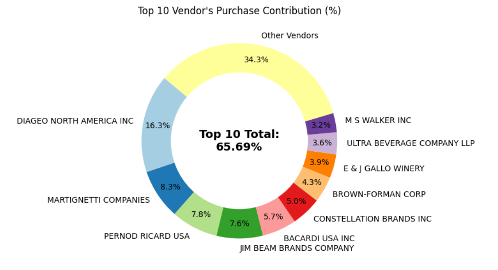
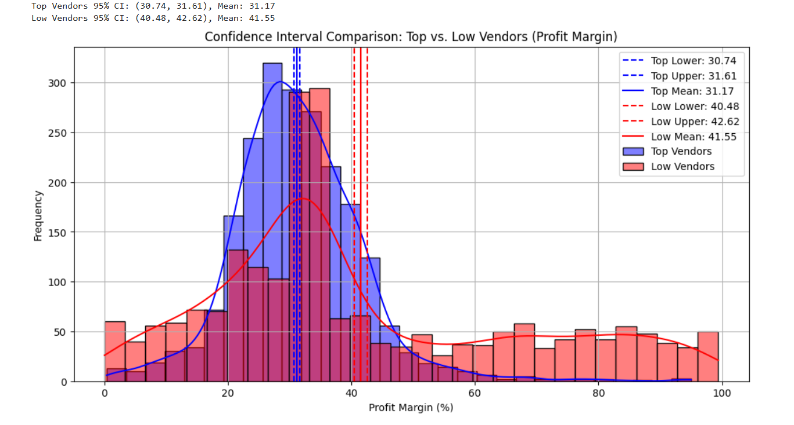

# 📊 Inventory & Sales Analytics — Retail/Wholesale EDA

> End-to-end Exploratory Data Analysis on **10,692 retail/wholesale transactions**
> to identify profitability drivers, vendor risks, and inventory inefficiencies.


---

## 📌 Business Problem

Retail and wholesale companies incur losses due to inefficient pricing,
poor inventory turnover, and vendor dependency. This project analyzes
transactional data to:

- Identify underperforming brands needing promotional or pricing adjustments
- Determine top vendors contributing to sales and gross profit
- Analyze the impact of bulk purchasing on unit costs
- Assess inventory turnover to reduce holding costs
- Investigate profitability variance between vendor groups

---

## 🗂️ Dataset Overview

| Metric | Value |
|--------|-------|
| Total Records | 10,692 |
| Features | 16 |
| Total Sales | $441.41M |
| Total Purchases | $307.34M |
| Gross Profit | $134.07M |
| Avg Profit Margin | 38.72% |
| Unsold Inventory Capital | $2.71M |

---

## 🔍 Key Findings

| # | Finding | Impact |
|---|---------|--------|
| 1 | 198 brands have high margins but low sales | Promotional opportunity |
| 2 | Top 10 vendors = 65.7% of total purchases | Supply chain risk |
| 3 | Bulk orders → 72% lower unit cost ($10.78 vs $39.06) | Cost optimization |
| 4 | $2.71M capital tied in unsold inventory | Cash flow inefficiency |
| 5 | Low-performing vendors avg 41.55% margin vs 31.17% top vendors | Pricing gap confirmed via hypothesis test |

---

## 📊 Power BI Dashboard


> Dashboard shows KPI cards for Total Sales, Purchases, Gross Profit,
> Profit Margin, and Unsold Capital — with vendor contribution breakdown,
> top brands by sales, low-performing vendors, and brand scatter analysis.

---

## 📈 Python Visualizations

### 1. Feature Distributions


> Histograms across all 16 features reveal right-skewed distributions,
> premium price outliers, and zero-sales products indicating slow-moving stock.

---

### 2. Correlation Heatmap


> Strong correlation (0.999) between Total Purchased Quantity and Total
> Sales Quantity confirms efficient inventory turnover. Profit Margin shows
> weak negative correlation with Sales Price (-0.179).

---

### 3. Brands — Low Sales vs High Profit Margin


> 198 target brands (red) identified with sales below threshold but margins
> above 65% — strong candidates for targeted promotions and pricing optimization.

---

### 4. Top 10 Vendor Purchase Contribution


> Diageo North America leads at 16.3%. Top 10 vendors collectively control
> 65.69% of total purchases, creating significant supply chain concentration risk.

---

### 5. Profit Margin — Top vs Low Vendors (Hypothesis Test)


> Hypothesis test result: **null hypothesis rejected**. Top vendors mean
> margin = 31.17% (CI: 30.74–31.61%) vs low vendors mean = 41.55%
> (CI: 40.48–42.62%). The two groups operate under distinctly different
> profitability models.

---

## 📁 Project Structure

```
inventory-sales-analytics/
├── data/
│   └── raw/                      # Raw CSV dataset
├── notebooks/                    # Jupyter EDA notebooks
├── src/
│   ├── data_cleaning.py          # Filtering, outlier handling
│   ├── analysis.py               # Correlations, hypothesis testing
│   └── visualizations.py        # All chart generation
├── sql/
│   └── queries.sql               # SQLite queries
├── powerbi/
│   ├── dashboard.pbix            # Power BI file
│   └── screenshots/
│       └── Dashboard.png
├── reports/
│   ├── EDA_Insights.pdf
│   └── visualizations/           # Exported Python charts
├── requirements.txt
└── README.md
```

---

## ⚙️ How to Run

```bash
# Install dependencies
pip install -r requirements.txt

# Launch notebook
jupyter notebook notebooks/your_notebook.ipynb
```

---

## 💡 Recommendations

- **Promote** 198 high-margin, low-sales brands to boost volume without
  sacrificing profitability
- **Diversify** vendor base — top 10 vendors controlling 65.7% is a
  significant supply chain risk
- **Leverage bulk purchasing** — unit cost drops 72% on large orders
- **Clear slow-moving stock** — $2.71M in unsold inventory is hurting
  cash flow
- **Coach low-performing vendors** on distribution and marketing to
  convert their high margins into actual sales volume
## Analysis by
- **Name** : Rohan Singh
- **Institute** : Indian Institute of Technology ( Indian School of Mines ) Dhanbad
